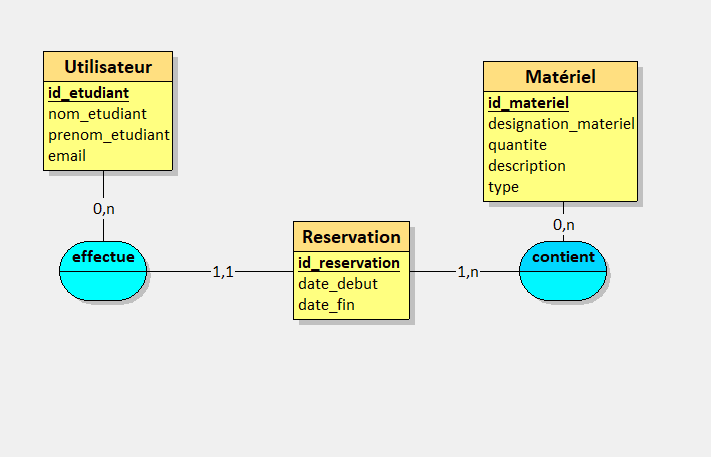
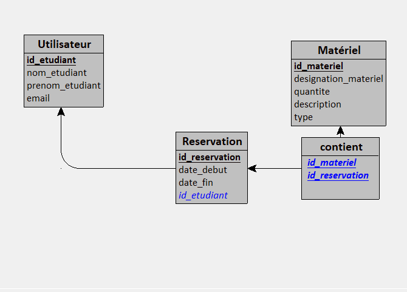

# TP1 SQL
## Analyse
On doit permettre à des étudiants de réserver du matériel. 
On a donc besoin de deux tables : 
- utilisateur qui va comporter le numéro d'étudiant en id, ainsi que le nom, prénom et email de l'étudiant.
- matériel avec un id ainsi que le nom du matériel, la quantité disponible, une description et un type de matériel.
On doit aussi définir des dates de début et fin de réservation. Pour ça on va avoir une table réservation qui va contenir ces dates, ainsi que l'id de l'étudiant qui a effectué la réservation, en clé étrangère.
Enfin, chaque réservation va contenir du matériel, on va donc créer une table contient qui va contenir l'id du matériel et l'id de la réservation.
Tout cela nous donne les MCD et MLD ci-dessous:
## MCD, MLD



## Création des tables
```
CREATE DATABASE IF NOT EXISTS tp1_3a;
USE tp1_3a;
DROP TABLE IF EXISTS utilisateur;
DROP TABLE IF EXISTS materiel;
DROP TABLE IF EXISTS reservation;
DROP TABLE IF EXISTS contient;

-- TABLE UTILISATEUR
-- id_etudiant correspond au numéro d'étudiant
-- nom_etudiant correspond au nom de l'étudiant
-- prenom_etudiant correspond au prénom de l'étudiant
CREATE TABLE utilisateur(
   id_etudiant INT PRIMARY KEY AUTO_INCREMENT NOT NULL,
   nom_etudiant VARCHAR(50) NOT NULL,
   prenom_etudiant VARCHAR(50) NOT NULL,
   email VARCHAR(50) NOT NULL
);

-- TABLE MATERIEL
-- id_materiel correspond a l'id du matériel, qui sera auto incrémenté
-- designation correspond au nom du matériel (ex : capteur de température TC74)
CREATE TABLE materiel(
   id_materiel INT PRIMARY KEY AUTO_INCREMENT NOT NULL,
   designation_materiel VARCHAR(50) NOT NULL,
   quantite VARCHAR(50),
   description VARCHAR(50),
   type VARCHAR(50)
);

-- TABLE DE RESERVATION
-- présence des dates de début et fin de la réservation du matériel
CREATE TABLE reservation(
   id_reservation INT PRIMARY KEY AUTO_INCREMENT NOT NULL,
   date_debut DATE NOT NULL,
   date_fin DATE NOT NULL,
   id_etudiant INT NOT NULL,
   FOREIGN KEY(id_etudiant) REFERENCES utilisateur(id_etudiant)
);

CREATE TABLE contient(
   id_materiel INT,
   id_reservation INT,
   PRIMARY KEY(id_materiel, id_reservation),
   FOREIGN KEY(id_materiel) REFERENCES materiel(id_materiel),
   FOREIGN KEY(id_reservation) REFERENCES reservation(id_reservation)
);
```

## Exercice 1
### Question 1
```
INSERT INTO utilisateur (id_etudiant, nom_etudiant, prenom_etudiant, email) VALUES
(1, 'Doe', 'John', 'john.doe@example.com'),
(2, 'Smith', 'Alice', 'alice.smith@example.com'),
(3, 'Johnson', 'Michael', 'michael.johnson@example.com'),
(4, 'Brown', 'Emily', 'emily.brown@example.com'),
(5, 'Taylor', 'James', 'james.taylor@example.com'),
(6, 'Anderson', 'Sarah', 'sarah.anderson@example.com'),
(7, 'Martinez', 'David', 'david.martinez@example.com'),
(8, 'Jones', 'Jessica', 'jessica.jones@example.com'),
(9, 'Garcia', 'Daniel', 'daniel.garcia@example.com'),
(10, 'Wilson', 'Emma', 'emma.wilson@example.com')
```
### Question 2
```
INSERT INTO materiel (id_materiel, designation_materiel, quantite, description, type) VALUES
(1, 'Ordinateur portable', 20, 'Ordinateur portable de dernière génération', 'Informatique'),
(2, 'Imprimante', 15, 'Imprimante laser couleur', 'Informatique'),
(3, 'Projecteur', 10, 'Projecteur HD pour présentations', 'Électronique'),
(4, 'Perceuse', 8, 'Perceuse électrique sans fil', 'Outils'),
(5, 'Scie circulaire', 12, 'Scie circulaire professionnelle', 'Outils'),
(6, 'Caméra', 5, 'Caméra haute définition', 'Électronique'),
(7, 'Microphone', 10, 'Microphone professionnel', 'Audio'),
(8, 'Casque audio', 20, 'Casque audio sans fil avec réduction de bruit', 'Audio'),
(9, 'Tablette graphique', 7, 'Tablette graphique pour dessin numérique', 'Informatique'),
(10, 'Câble HDMI', 50, 'Câble HDMI haute vitesse', 'Accessoire');
```
### Question 3
```
INSERT INTO reservation (date_debut, date_fin, id_etudiant) VALUES
('2024-03-20', '2024-03-25', 1), -- John Doe réserve du 20 au 25 mars
('2024-03-21', '2024-03-28', 2), -- Alice Smith réserve du 21 au 28 mars
('2024-03-22', '2024-03-27', 3), -- Michael Johnson réserve du 22 au 27 mars
('2024-03-23', '2024-03-29', 4), -- Emily Brown réserve du 23 au 29 mars
('2024-03-24', '2024-03-26', 5); -- James Taylor réserve du 24 au 26 mars


INSERT INTO contient (id_materiel, id_reservation) VALUES
    (1, 1), -- Matériel 1 inclus dans la réservation 1
    (2, 1) -- Matériel 2 inclus dans la réservation 1
    (3, 1), -- Matériel 3 inclus dans la réservation 2
    (2, 2), -- Matériel 2 inclus dans la réservation 2
    (3, 3), -- Matériel 3 inclus dans la réservation 3
    (4, 4), -- Matériel 4 inclus dans la réservation 4
    (5, 5), -- Matériel 5 inclus dans la réservation 5
    (2, 5), -- Matériel 2 inclus dans la réservation 5
    (2, 4); -- Matériel 2 inclus dans la réservation 4
```

## Exercice 2
```
SELECT * FROM utilisateur WHERE email LIKE "%example%";

SELECT designation_materiel FROM materiel WHERE type = "Informatique";

SELECT * FROM reservation WHERE date_debut > "2024-03-22";
```

## Exercice 3
```
SELECT nom_etudiant, prenom_etudiant, date_debut, date_fin FROM utilisateur INNER JOIN reservation USING(id_etudiant);

SELECT designation_materiel, date_debut, date_fin FROM materiel INNER JOIN contient USING(id_materiel) INNER JOIN reservation USING(id_reservation);

SELECT nom_etudiant, prenom_etudiant, designation_materiel FROM utilisateur INNER JOIN reservation USING(id_etudiant) INNER JOIN contient USING(id_reservation) INNER JOIN materiel USING(id_materiel);

SELECT * FROM materiel INNER JOIN contient USING(id_materiel) INNER JOIN reservation USING(id_reservation) INNER JOIN utilisateur USING(id_etudiant) WHERE nom_etudiant = "Johnson";
```

## EXERCICE 4
```
SELECT COUNT(*) FROM reservation WHERE date_debut > "2024-03-22" AND date_fin < "2024-03-29";

SELECT COUNT(DISTINCT id_etudiant) FROM reservation;
```

## EXERCICE 5
```
UPDATE materiel SET quantite = 10 WHERE type = "Informatique";
UPDATE contient SET id_materiel = 2 WHERE id_reservation = 1;
```

## EXERCICE 6
```
DELETE FROM materiel WHERE id_materiel = 9;
DELETE FROM contient WHERE id_reservation = 1;
DELETE FROM reservation WHERE id_etudiant = 1;
DELETE FROM utilisateur WHERE id_etudiant = 1;
```

## EXERCICE 7
### QUESTION 1
```
SELECT DISTINCT id_etudiant, nom_etudiant, prenom_etudiant FROM utilisateur INNER JOIN reservation USING(id_etudiant);
```

### QUESTION 2
```
SELECT id_materiel, designation_materiel FROM materiel WHERE id_materiel NOT IN (SELECT id_materiel FROM contient);
```

### QUESTION 3
```
SELECT id_materiel, designation_materiel, COUNT(*) FROM materiel INNER JOIN contient USING(id_materiel) GROUP BY id_materiel HAVING COUNT(*) > 3;
```

### QUESTION 4
```
SELECT utilisateur.id_etudiant, nom_etudiant, prenom_etudiant, COUNT(reservation.id_etudiant) as nb_reservation FROM utilisateur LEFT JOIN reservation USING(id_etudiant) GROUP BY utilisateur.id_etudiant
```

## EXERCICE 8
### QUESTION 1
```
CREATE TABLE disponibilite(
   id_disponibilite INT PRIMARY KEY AUTO_INCREMENT NOT NULL,
   date_debut VARCHAR(50) NOT NULL,
   date_fin VARCHAR(50) NOT NULL,
   id_materiel INT NOT NULL,
   FOREIGN KEY(id_materiel) REFERENCES Materiel(id_materiel)
);
```

### QUESTION 2
```
ALTER TABLE Reservation
ADD COLUMN id_disponibilite INT NOT NULL,
ADD CONSTRAINT fk_disponibilite
FOREIGN KEY (id_disponibilite) REFERENCES Disponibilite(id_disponibilite);
```

### QUESTION 3
```
CREATE TRIGGER before_insert_reservation 
BEFORE INSERT ON reservation 
FOR EACH ROW
BEGIN
    DECLARE id_disp INT;
        IF NEW.date_debut IS NOT NULL AND NEW.date_fin IS NOT NULL AND NEW.id_materiel IS NOT NULL THEN
        SET id_disp = (SELECT id_disponibilite FROM disponibilite WHERE date_debut = NEW.date_debut AND date_fin = NEW.date_fin AND id_materiel = NEW.id_materiel);
            IF id_disponibilite IS NULL THEN
                INSERT INTO disponibilite (date_debut, date_fin, id_materiel) VALUES (NEW.date_debut, NEW.date_fin, NEW.id_materiel);
                SET id_disponibilite = LAST_INSERT_ID();
        	ELSE
            	SIGNAL SQLSTATE '45000' SET MESSAGE_TEXT = 'La réservation existe déjà';
   		    END IF;
   SET NEW.id_disponibilite = id_disponibilite;
   END IF;
END;
```