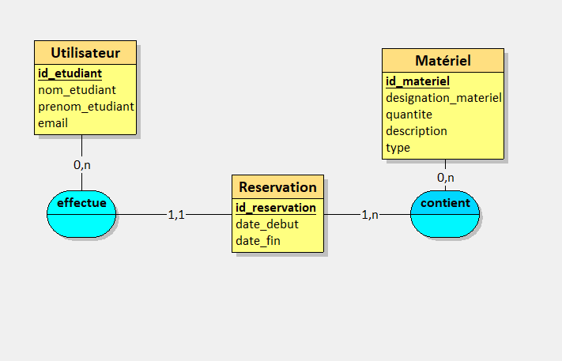
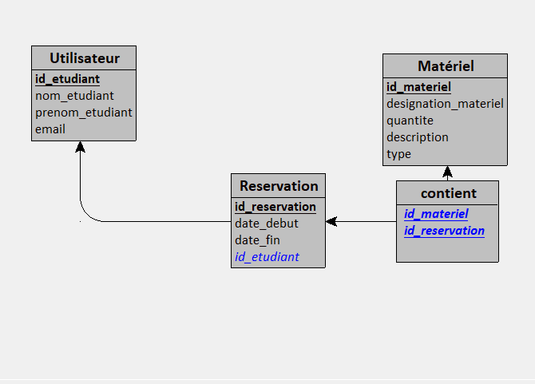

# TP1 SQL
## Analyse
On doit permettre à des étudiants de réserver du matériel. On a donc besoin de deux tables : une table Etudiant qui va comporter le numéro d'étudiant en id, ainsi que le nom et prénom de l'étudiant, et une table matériel avec un id ainsi que le nom du matériel.
On doit aussi définir des dates de début et fin de réservation. Pour ça on va avoir une troisième table réservation qui va contenir ces dates.
On a donc un utilisateur, qui peut éffectuer des réservations, qui vont contenir du matériel.
## MCD, MLD



## Création des tables
```
CREATE DATABASE IF NOT EXISTS tp1;
USE tp1;
DROP TABLE IF EXISTS Utilisateur;
DROP TABLE IF EXISTS Materiel;
DROP TABLE IF EXISTS Reservation;
DROP TABLE IF EXISTS contient;

-- TABLE UTILISATEUR
-- id_etudiant correspond au numéro d'étudiant
-- nom_etudiant correspond au nom de l'étudiant
-- prenom_etudiant correspond au prénom de l'étudiant
CREATE TABLE Utilisateur(
   id_etudiant INT PRIMARY KEY NOT NULL,
   nom_etudiant VARCHAR(50) NOT NULL,
   prenom_etudiant VARCHAR(50) NOT NULL,
   email VARCHAR(50) NOT NULL
);

-- TABLE MATERIEL
-- id_materiel correspond a l'id du matériel, qui sera auto incrémenté
-- designation correspond au nom du matériel (ex : capteur de température TC74)
CREATE TABLE Materiel(
   id_materiel INT PRIMARY KEY AUTO_INCREMENT NOT NULL,
   designation_materiel VARCHAR(50) NOT NULL,
   quantite VARCHAR(50),
   description VARCHAR(50),
   type VARCHAR(50)
);

-- TABLE DE RESERVATION
-- présence des dates de début et fin de la réservation du matériel
CREATE TABLE Reservation(
   id_reservation INT PRIMARY KEY AUTO_INCREMENT NOT NULL,
   date_debut VARCHAR(50) NOT NULL,
   date_fin VARCHAR(50) NOT NULL,
   id_etudiant INT NOT NULL,
   FOREIGN KEY(id_etudiant) REFERENCES Utilisateur(id_etudiant)
);

CREATE TABLE contient(
   id_materiel INT,
   id_reservation INT,
   PRIMARY KEY(id_materiel, id_reservation),
   FOREIGN KEY(id_materiel) REFERENCES Materiel(id_materiel),
   FOREIGN KEY(id_reservation) REFERENCES Reservation(id_reservation)
);
```

## Exercice 1
### Question 1
```
INSERT INTO utilisateur (id_etudiant, nom_etudiant, prenom_etudiant, email) VALUES
(1, 'Doe', 'John', 'john.doe@example.com'),
(2, 'Smith', 'Alice', 'alice.smith@example.com'),
(3, 'Johnson', 'Michael', 'michael.johnson@example.com'),
(4, 'Brown', 'Emily', 'emily.brown@example.com'),
(5, 'Taylor', 'James', 'james.taylor@example.com'),
(6, 'Anderson', 'Sarah', 'sarah.anderson@example.com'),
(7, 'Martinez', 'David', 'david.martinez@example.com'),
(8, 'Jones', 'Jessica', 'jessica.jones@example.com'),
(9, 'Garcia', 'Daniel', 'daniel.garcia@example.com'),
(10, 'Wilson', 'Emma', 'emma.wilson@example.com')
```
### Question 2
```
INSERT INTO materiel (designation_materiel, quantite, description, type) VALUES
('Ordinateur portable', 20, 'Ordinateur portable de dernière génération', 'Informatique'),
('Imprimante', 15, 'Imprimante laser couleur', 'Informatique'),
('Projecteur', 10, 'Projecteur HD pour présentations', 'Électronique'),
('Perceuse', 8, 'Perceuse électrique sans fil', 'Outils'),
('Scie circulaire', 12, 'Scie circulaire professionnelle', 'Outils'),
('Caméra', 5, 'Caméra haute définition pour la vidéo-surveillance', 'Électronique'),
('Microphone', 10, 'Microphone professionnel pour enregistrements audio', 'Audio'),
('Casque audio', 20, 'Casque audio sans fil avec réduction de bruit', 'Audio'),
('Tablette graphique', 7, 'Tablette graphique pour dessin numérique', 'Informatique'),
('Câble HDMI', 50, 'Câble HDMI haute vitesse', 'Accessoire')
```
### Question 3
```
INSERT INTO Reservation (date_debut, date_fin, id_etudiant) VALUES
('2024-03-20', '2024-03-25', 1), -- John Doe réserve du 20 au 25 mars
('2024-03-21', '2024-03-28', 2), -- Alice Smith réserve du 21 au 28 mars
('2024-03-22', '2024-03-27', 3), -- Michael Johnson réserve du 22 au 27 mars
('2024-03-23', '2024-03-29', 4), -- Emily Brown réserve du 23 au 29 mars
('2024-03-24', '2024-03-26', 5); -- James Taylor réserve du 24 au 26 mars


INSERT INTO contient (id_materiel, id_reservation) VALUES
(1, 1), -- Matériel 1 inclus dans la réservation 1
(2, 2), -- Matériel 2 inclus dans la réservation 2
(3, 3), -- Matériel 3 inclus dans la réservation 3
(4, 4), -- Matériel 4 inclus dans la réservation 4
(5, 5); -- Matériel 5 inclus dans la réservation 5
```

## Exercice 2
```
SELECT * FROM utilisateur WHERE email LIKE "%example%";
SELECT designation_materiel FROM materiel WHERE type = "Informatique";
SELECT * FROM reservation WHERE date_debut > "2024-03-22";
```

## Exercice 3
```
SELECT nom_etudiant, prenom_etudiant, date_debut, date_fin FROM utilisateur INNER JOIN reservation USING(id_etudiant);
SELECT designation_materiel, date_debut, date_fin FROM materiel INNER JOIN contient USING(id_materiel) INNER JOIN reservation USING(id_reservation);
SELECT nom_etudiant, prenom_etudiant, designation_materiel FROM utilisateur INNER JOIN reservation USING(id_etudiant) INNER JOIN contient USING(id_reservation) INNER JOIN materiel USING(id_materiel);
```